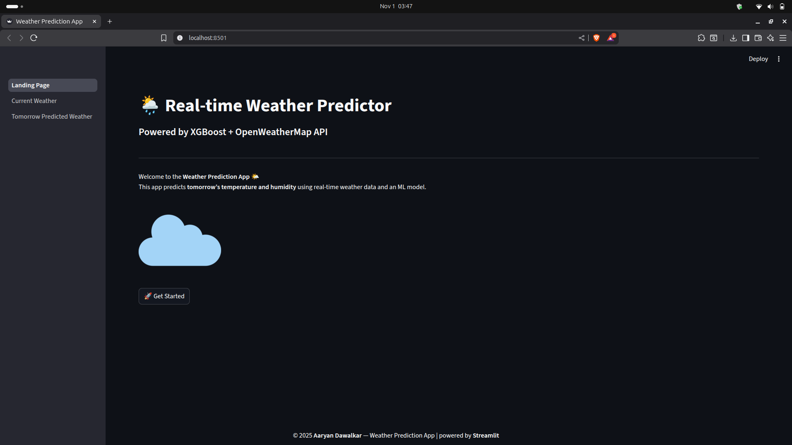
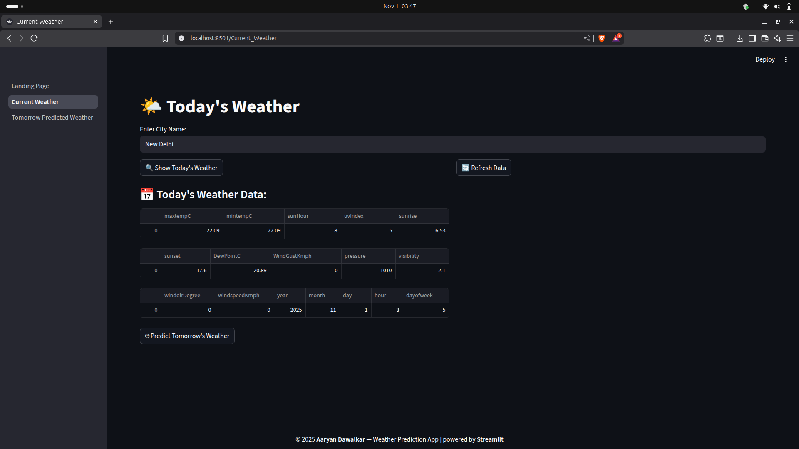
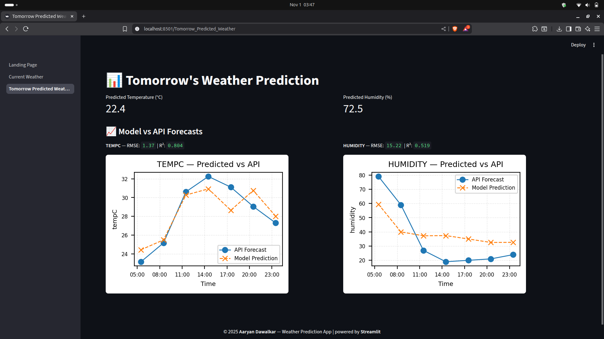

# 🌦️ Real-Time Weather Prediction using Machine Learning

A personal project that predicts **real-time temperature (°C)** using historical weather data and **live API integration**.  
The model is trained on 3 years of weather data and deployed to deliver **instant predictions** with evaluated accuracy metrics.

---

## 🚀 Features

- 📈 Predicts temperature (°C) in real-time using weather API inputs
- 🧠 Machine Learning model trained using regression algorithms
- 📊 Displays **RMSE** and **R² Score** for performance evaluation
- 🌐 Live visualization of actual vs. predicted temperature trends
- 🖥️ Interactive and lightweight design for quick experimentation

---

## 🧰 Tech Stack

- **Language:** Python
- **Libraries:** NumPy, Pandas, Scikit-learn, Matplotlib, Seaborn, Requests
- **Tools:** Jupyter Notebook / VS Code
- **Data Source:** Kaggle Dataset(3 years of historical) + Weather API(live data)

---

## 🧩 Application Pages

### 🏠 1. Home Page

Displays the project introduction, purpose, and navigation to other pages.



---

### 📅 2. Current Weather

Shows real-time weather data from API (Temperature, Humidity, Precipitation, Cloud Cover).



---

### 🤖 3. Model Prediction along with Performance Comparison

Displays evaluation metrics (RMSE, R²) for Random Forest models compared to actual API predictions across different weather parameters.



---

## ⚙️ How It Works

1. Fetches weather data via API and preprocesses it for model prediction.
2. Used trained MultiForestRegression model on 3 years of data for temperature prediction.
3. Evaluates the model using **RMSE** and **R²** metrics.
4. Plots API vs. predicted temperatures for visual insight.

---

## 📊 Model Performance

| Metric          | Value |
| :-------------- | :---- |
| TEMPC — RMSE    | 1.37  |
| TEMPC — R²      | 0.804 |
| HUMIDITY — RMSE | 15.22 |
| HUMIDITY — R²   | 0.519 |

> _\*Values are based on the final trained model testing and may vary with API data._

---

## 💻 Installation & Usage

```bash
# 1. Clone the repository
git clone https://github.com/Aaryan10000/Weather-Prediction-ML.git

# 2. Navigate to the project directory
cd Weather-Prediction-ML

# 3. Install dependencies
pip install -r requirements.txt

# 4. Get personal API key
goto https://openweathermap.org/api and create free account.
Get basic api key and replace it in the pages/*.py files.

# 5. Run the Streamlit app
streamlit run Landing_Page.py
```

---

## 📚 Learning Highlights

- Implemented real-time data integration using APIs

- Understood regression evaluation metrics (RMSE & R²)

- Enhanced data visualization and model interpretability

- Gained experience in deploying ML models through Streamlit
